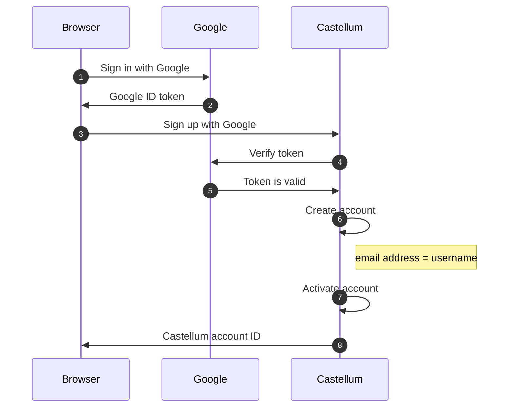

# Castellum Authentication via Google

Allow users to sign up and sign in to Castellum using their Google account.

It verifies a Google ID token to create a Castelllum account with the respective
email address as username.

> p.s. the Google ID token verification is done on server side.

**IMPORTANT:** Google email address as Castellum username

It assumes your Castellum app is expecting to have email as username,
otherwise your users might end up with two different accounts. e.g. 1st account
with username `someone` and another account with username `someone@gmail.com`
because they are just usernames, but they are different, even though they are
possibly the same user.

> Meaning, if you need to look for users already registered with a different
> username, but same email address, you need to implement your own solution.

**IMPORTANT:** Google ID token as Castellum session

As long as a Google ID token is valid, it can work as a Castellum session,
because the respective Castellum account can be retrieved from the ID token,
as the Google email address in the ID token matches the username of the
respective Castellum account.

## How it works

